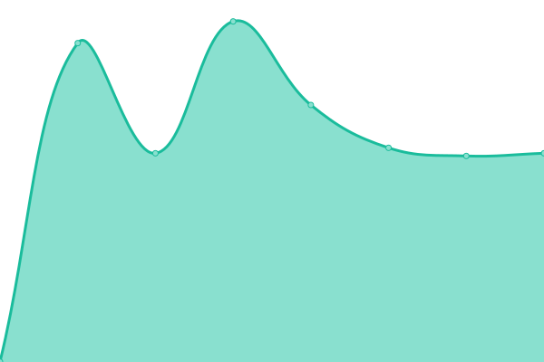

# [📈 Live Status](https://Warwick-Engineering-Society.github.io/uptime): <!--live status--> **🟧 Partial outage**

This repository contains the open-source uptime monitor and status page for [Warwick Engineering Society](www.warwickengineers.co.uk), powered by [Upptime](https://github.com/upptime/upptime).

With [Upptime](https://upptime.js.org), you can get your own unlimited and free uptime monitor and status page, powered entirely by a GitHub repository. We use [Issues](https://github.com/Warwick-Engineering-Society/uptime/issues) as incident reports, [Actions](https://github.com/Warwick-Engineering-Society/uptime/actions) as uptime monitors, and [Pages](https://Warwick-Engineering-Society.github.io/uptime) for the status page.

<!--start: status pages-->
<!-- This summary is generated by Upptime (https://github.com/upptime/upptime) -->
<!-- Do not edit this manually, your changes will be overwritten -->
<!-- prettier-ignore -->
| URL | Status | History | Response Time | Uptime |
| --- | ------ | ------- | ------------- | ------ |
|  [Main Site (warwickengineers.co.uk)](https://warwickengineers.co.uk) | 🟩 Up | [main-site-warwickengineers-co-uk.yml](https://github.com/Warwick-Engineering-Society/uptime/commits/HEAD/history/main-site-warwickengineers-co-uk.yml) | 

 910ms
     
 | 

<a href="https://Warwick-Engineering-Society.github.io/uptime/history/main-site-warwickengineers-co-uk">100.00%</a>
    

|  [URL Shortener (engsoc.uk)](https://engsoc.uk) | 🟩 Up | [url-shortener-engsoc-uk.yml](https://github.com/Warwick-Engineering-Society/uptime/commits/HEAD/history/url-shortener-engsoc-uk.yml) | 

 899ms
     
 | 

<a href="https://Warwick-Engineering-Society.github.io/uptime/history/url-shortener-engsoc-uk">100.00%</a>
    

|  [Past Paper Database](https://pp.engsoc.uk) | 🟥 Down | [past-paper-database.yml](https://github.com/Warwick-Engineering-Society/uptime/commits/HEAD/history/past-paper-database.yml) | 

 0ms
     
 | 

<a href="https://Warwick-Engineering-Society.github.io/uptime/history/past-paper-database">0.00%</a>
    

|  [Docs](https://docs.engsoc.uk) | 🟥 Down | [docs.yml](https://github.com/Warwick-Engineering-Society/uptime/commits/HEAD/history/docs.yml) | 

 486ms
     
 | 

<a href="https://Warwick-Engineering-Society.github.io/uptime/history/docs">0.00%</a>
    

|  [PDR App](pdr.engsoc.uk) | 🟥 Down | [pdr-app.yml](https://github.com/Warwick-Engineering-Society/uptime/commits/HEAD/history/pdr-app.yml) | 

 0ms
     
 | 

<a href="https://Warwick-Engineering-Society.github.io/uptime/history/pdr-app">0.00%</a>
    

<!--end: status pages-->

[**Visit our status website →**](https://Warwick-Engineering-Society.github.io/uptime)

## 📄 License

- Powered by: [Upptime](https://github.com/upptime/upptime)
- Code: [MIT](./LICENSE) © [Warwick Engineering Society](www.warwickengineers.co.uk)
- Data in the `./history` directory: [Open Database License](https://opendatacommons.org/licenses/odbl/1-0/)
